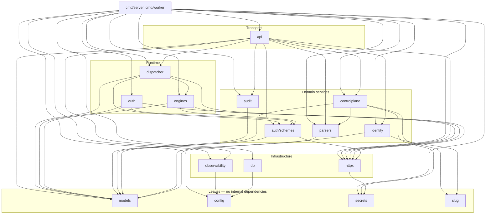
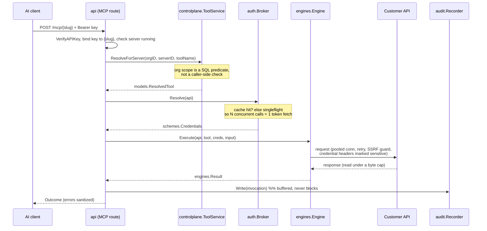

# Architecture

GridHook wraps an arbitrary REST, SOAP or GraphQL API and exposes it to an AI
agent as a callable tool, with credentials encrypted at rest, per-organization
tenancy, and an audit trail on every call.

This document describes how the code is organised and, where a decision is not
obvious, why it was made that way.

---

## 1. The shape of the problem

The central design fact is that **a connector is data, not code**.

Adding support for a new SaaS product means inserting rows — a `connectors`
row, a `connector_apis` row with a base URL and auth type, and `mcp_tools` rows
describing callable operations. It does not mean writing Go. A user can point
the importer at an OpenAPI document and get a working connector without anyone
shipping a release.

That inverts the usual integration-platform layout. There is no
`connectors/github/`, no `connectors/stripe/`, no per-vendor `Sync()` method,
because there is no per-vendor code to put in them. What varies between
connectors is *configuration*; what varies between **protocols** is code, and
there are exactly three protocols.

So the plugin seam sits one level down from where an integration platform
usually puts it:

| Varies by | Mechanism | Count |
|---|---|---|
| Wire protocol | `engines.Engine` | 3 (REST, SOAP, GraphQL) |
| Credential style | `schemes.Scheme` | 5 (OAuth2, Bearer, API key, Basic, login token) |
| Import format | `parsers.Parser` | 5 (OpenAPI, WSDL, Postman, curl, GraphQL SDL) |
| Vendor | database rows | unbounded |

Each of the three is a registry mapping a typed key to an interface. There is
no type switch on protocol or auth type anywhere in the codebase; adding a
fourth engine is a new file plus one line in `NewRegistry`.

---

## 2. Layers

```
cmd/                composition roots — the only place that reads config,
                    constructs dependencies, and owns shutdown order

internal/
  models/           domain types. Zero internal imports.
  config/           the only package that reads the environment
  secrets/          the encryption boundary for credential material
  slug/             URL-safe identifier generation

  db/               Postgres connection and pool tuning
  httpx/            the shared outbound HTTP client (retry, SSRF guard, caps)
  observability/    structured logging, request correlation, panic recovery

  identity/         users, sessions, passwords, organizations membership
  controlplane/     repositories for connectors, APIs, tools, groups, servers
  parsers/          spec document -> draft tools

  auth/             credential brokering + token cache
  auth/schemes/     one strategy per credential style
  engines/          one engine per wire protocol
  dispatcher/       tool call -> credentials -> engine -> audit record

  audit/            append-only invocation log (Recorder writes, Reader queries)
  api/              chi routes, DTOs, error mapping
```

### Dependency graph

Acyclic, and layered so that the domain has no infrastructure beneath it:



Two directions are load-bearing and were corrected during this work:

- **`models` imports nothing.** It previously imported `internal/db` so that
  GORM `BeforeSave`/`AfterFind` hooks could reach a `Sealer`. Domain types
  depending on infrastructure is the wrong direction, and the mechanism was
  worse than the dependency — see §4.
- **`controlplane` no longer imports `dispatcher`.** `ToolService` implements
  `dispatcher.ToolStore`, and used to import the dispatcher purely to return
  `*dispatcher.ToolLookup`. The implementer importing the consumer's package
  means the dispatcher can never refer to a control-plane type without a cycle.
  The DTO moved to `models.ResolvedTool`.

Interfaces are declared **where they are consumed**, not where they are
implemented: `dispatcher.ToolStore`, `dispatcher.CredentialResolver`,
`dispatcher.AuditWriter` and `auth.CredentialsStore` all live next to the code
that calls them. That is what lets the entire dispatch path be tested with
fakes and no database — `internal/dispatcher` sits at 98% coverage without a
Postgres instance anywhere in sight.

---

## 3. How a call flows



The agent never sees a credential. The credential is decrypted in memory at
dispatch time, injected into the outbound request, and — critically — is
stripped from the request if the upstream redirects to a different host.

---

## 4. Security architecture

### Tenancy is enforced in SQL

The single most important invariant: **every service method that accepts a
resource ID also accepts an organization ID, and applies it as a SQL
predicate**. Not as a caller-side check, not as middleware, but in the
statement itself.

`connector_apis` and `mcp_tools` have no `organization_id` column, so they
reach their tenant through their parent connector:

```go
func orgScopedTools(tx *gorm.DB, orgID int64) *gorm.DB {
    return tx.Where(`mcp_tools.connector_api_id IN (
        SELECT a.id FROM connector_apis a
        JOIN connectors c ON c.id = a.connector_id
        WHERE c.organization_id = ?)`, orgID)
}
```

The predicate is applied uniformly to reads *and* writes. A subquery is used
rather than a join specifically because GORM's `Updates` and `Delete` builders
do not compose with `Joins` — and getting that wrong on the write path is how a
tenant ends up able to overwrite another tenant's credentials.

"Missing" and "belongs to another organization" both return `ErrNotFound`. The
distinction is useful only to someone enumerating other tenants' resources.

There is exactly one deliberate exception, and it carries a comment saying so:
`APIService.LoadCredentials` is unscoped because it runs on the dispatch path,
where the `connector_api_id` came from an already-scoped tool resolution and
therefore cannot be attacker-chosen. It must never be reachable from a route.

### Credentials

- **At rest**: AES-256-GCM, random nonce per seal, applied explicitly at the
  repository boundary (`sealCredentials` / `openCredentials`).
- **Not via ORM hooks.** The previous design smuggled the `Sealer` through a
  stringly-keyed GORM session value and decrypted in `AfterFind`. That made
  "did this query remember to attach the sealer?" a runtime question, forced
  the domain package to import infrastructure, and meant *any* query that
  happened to load the row produced a struct full of live plaintext — including
  queries whose authors never intended to touch credentials.
- **In transit**: stripped on cross-host redirect. Go's stdlib drops
  `Authorization`, but connectors authenticate with whatever header the vendor
  chose, so engines mark credential headers explicitly via
  `httpx.MarkSensitive`.
- **In errors**: `*url.Error` embeds the full request URL, and API-key schemes
  inject the key as a query parameter. `httpx.SanitizeError` redacts it before
  the error reaches an API response *or* the `tool_invocations` table.
- **In logs**: `schemes.Credentials.String()` returns a fixed redacted string,
  so an accidental `%v` cannot print a live token.

### SSRF

The guard hooks `net.Dialer.Control`, which runs on the **resolved IP**,
immediately before connect. Validating the hostname instead would be defeated
by DNS rebinding or by a name that simply resolves inward.

Link-local (`169.254.0.0/16`, `fe80::/10`) is blocked unconditionally — that is
the cloud instance-metadata endpoint on AWS, GCP and Azure, and no legitimate
customer API lives there. RFC1918 and loopback are configurable and default to
*allowed*, because self-hosted deployments legitimately front internal APIs.

### Fail-closed defaults

`KMS_DATA_KEY` is mandatory when `APP_ENV=production`; startup fails without
it. The previous behaviour silently derived a hardcoded development key in
every environment, so a deployment that forgot to set one encrypted every
stored credential under a key committed to the repository.

`INTERNAL_TOKEN` unset disables the audit-ingest endpoint entirely rather than
leaving it open, and the comparison is `subtle.ConstantTimeCompare`.

---

## 5. Concurrency

| Concern | Mechanism |
|---|---|
| Audit writes must not add request latency | buffered channel + single drain goroutine; overflow is a counted drop, never a block |
| Audit must not be lost on deploy | `Recorder.Close(ctx)` drains before exit, wired into shutdown after the HTTP server stops accepting |
| Drain must not wedge on a slow DB | per-insert `context.WithTimeout` |
| Token-endpoint thundering herd | `singleflight` collapses concurrent resolutions of the same connector API into one |
| Token cache unbounded growth | opportunistic sweep of expired entries on write, above a threshold |
| Health check latency | `errgroup` with `SetLimit`, so a connector with ten APIs takes one probe's time, not ten |
| Panic containment | recovery at the HTTP boundary only; nothing below recovers |

Shutdown order is explicit and matters: HTTP server first (stop accepting), then
the audit recorder (flush what in-flight requests queued). Reversed, the tail of
the audit trail is lost on every deploy.

---

## 6. Notable defects found and fixed

Beyond the tenancy work, these were live bugs in the code as it stood:

| Defect | Consequence |
|---|---|
| MCP API key / slug binding check read `chi.URLParam(r, "slug")` from middleware mounted at `/mcp` | chi had not yet matched `{slug}`, so the value was always `""` and the guard **never fired**. Fixed by moving `{slug}` into the parent route pattern; both the broken and fixed shapes are pinned by tests. |
| `ConnectorService.List` counted without the filter | a filtered page of 3 advertised the unfiltered tenant total, paginating clients into empty pages |
| `audit.getInvocation` returned a bare `fmt.Errorf` | a missing audit record surfaced as **500** instead of 404 |
| `Register` checked email existence outside the transaction | two concurrent registrations for one email both succeeded with different password hashes, breaking the invariant `Login` depends on. Fixed with `pg_advisory_xact_lock` — no schema change needed. |
| `Login` returned early for an unknown email | bcrypt dominates the request, so a known email was measurably slower — an account-enumeration oracle. Fixed with a decoy comparison. |
| `HashPassword` applied no policy | accounts could be created with an empty password |
| Emails were not normalized | `Ada@x.com` and `ada@x.com` were separate accounts |
| `InMemoryTokenCache` never evicted | one live credential retained in memory per API, forever |
| Role/status strings passed straight to Postgres enums | an operator typo returned an opaque 500 from the driver |
| `BulkCreate` inserted outside a transaction, returning partial results with the error | a spec that failed halfway left a half-imported connector |
| `MCPServerService.hydrate` ran 2 queries per server | N+1 on every server list |
| Connector name interpolated into `Content-Disposition` | header injection via connector name |
| `ResolvedTool.ConnectorID` duplicated `API.ConnectorID` | a producer setting one but not the other wrote `connector_id = 0` into a NOT NULL FK column. Found *by a test*, fixed by deleting the duplicate field. |
| No request body size limits anywhere | any JSON endpoint was a memory-exhaustion vector |
| No response body size limits | an upstream could OOM the process |
| `handleServiceError` returned `err.Error()` on 500 | published SQL text, table names and DSNs to callers |

---

## 7. Testing

`make check` runs vet, lint and the race detector — that is the gate.

Coverage concentrates where the logic is:

| Package | Coverage | Notes |
|---|---|---|
| `dispatcher` | 98% | fakes for every collaborator |
| `auth` | 95% | includes singleflight collapse under `-race` |
| `auth/schemes` | 93% | OAuth2 against `httptest` |
| `secrets` | 92% | tamper detection, nonce uniqueness, concurrent use |
| `httpx` | 91% | retry semantics, redirect stripping, SSRF table |
| `observability` | 91% | log injection, panic containment |
| `slug` | 88% | URL/header safety fuzzing-by-table |
| `config` | 80% | every validation rule |
| `engines` | 77% | path traversal, param routing, credential injection |

The tests are written to pin *behaviour that was wrong*, not to chase a number.
`TestChiRouting_SlugIsInvisibleInMountLevelMiddleware` documents the broken
routing shape so the fix cannot be silently reverted;
`TestClient_Do_DoesNotRetryNonIdempotentMethods` exists because replaying a
POST can duplicate a charge.

---

## 8. Remaining technical debt

Named honestly, in priority order.

1. **The org-scoping fixes are not covered by tests.** `controlplane` sits at
   9% and `identity` at 13% because every method needs a live Postgres — the
   scoping is enforced *in SQL*, which is exactly what a mock cannot verify.
   This is the largest gap in the work: the most security-critical change is
   the least tested. The fix is `testcontainers-go` or a `docker compose` test
   database plus an integration build tag, with at minimum a two-tenant fixture
   asserting that every ID-taking method returns `ErrNotFound` across tenants.

2. **No authorization beyond tenancy.** `models.UserRole` exists with four
   values and is enforced nowhere: a `viewer` can mint MCP API keys and write
   credentials. Tenancy is closed; *roles* are not. This needs a policy layer
   between the router and the services.

3. **`api` is at 2.5% coverage.** Handlers take concrete `*controlplane.X`
   types, so testing one requires a database. Extracting per-handler interfaces
   would allow `httptest`-driven handler tests.

4. **Email normalization is not retroactive.** Existing mixed-case rows will no
   longer match at login. A migration should `LOWER()` the column and add a
   unique index — this was left out deliberately because it needs a
   data-collision decision an operator has to make.

5. **`bcryptCost` raised 10 → 12 without a rehash-on-login path.** Existing
   hashes still verify (bcrypt encodes its own cost) but never upgrade.

6. **No metrics or tracing.** Logging is structured and correlated, but there is
   no `/metrics` endpoint and no OpenTelemetry spans. The seams exist — every
   call already carries a request ID through context.

7. **Module creation is not transactional** across the tool group and its APIs;
   a partial failure leaves both behind. Recoverable through normal endpoints,
   but it needs a transaction handle threaded through the service layer to fix
   properly.

8. **`Sealer` has no key rotation.** `KMS_KEY_ID` is recorded but unused; there
   is no re-encrypt path, so rotating `KMS_DATA_KEY` orphans every stored
   credential.

9. **`spec_raw` is stored but never read.** Either wire it into a re-import flow
   or drop the column.

---

## 9. Scaling notes

- **Stateless already.** The only process-local state is the token cache, which
  is intentionally local so decrypted secrets never reach a shared store. Cost
  is one token fetch per process after a restart. Horizontal scaling needs no
  change.
- **The audit table is the first thing to grow.** `tool_invocations` stores full
  input and output JSON per call. It wants time-based partitioning and a
  retention policy before it becomes the largest table by an order of magnitude.
- **`connectorSelectSQL` does per-row subqueries** for tool and module counts.
  Fine at hundreds of connectors per tenant; at tens of thousands it wants a
  materialized view.
- **The dispatch path is one round trip** plus a possible token fetch. The
  natural next lever is honouring `mcp_tools.cached` / `cache_ttl_seconds`,
  which are stored and currently ignored.
- **The worker runs a single job** on a ticker with no leader election; running
  two replicas double-sweeps. Harmless for session cleanup, not for anything
  with side effects.
